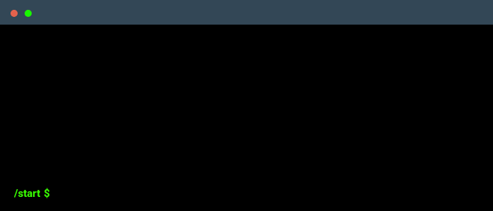

<h1 align="center">👋 Hello!</h1>

I am an experienced developer with expertise in a wide range of programming languages and frameworks. I am passionate about creating outstanding digital experiences that are both visually appealing and functional. I have worked on numerous projects, from building complex web applications to developing machine learning models. I am highly organized, detail-oriented, and committed to delivering high-quality work that meets my clients' needs. With my skills and experience, I am confident in my ability to tackle any development challenge that comes my way. 🚀

 
  

<h2 align="center">🛠️ My Tech Stack:</h2>

  
  
  
  
  
  
  
  
  
  
  
  
  
  
  
  
  
  
  
  
  

<h2 align="center">📊 GitHub Stats:</h2>

  
   
   
  

  
   
   
  

<h2 align="center">📊 Top Languages Used:</h2>

  
   
   
  

<h2 align="center">🔝 Top Contributed Repo</h2>

  

<h2 align="center">🏆 GitHub Trophies:</h2>

  
   
   
  

  <h2 align="center">📊 Full Statistics</h2>
  
  
 
    
![Metrics](https://metrics.lecoq.io/ElonMusk2002?template=classic&languages=1&lines=1&habits=1&followup=1&isocalendar=1&base=header%2C%20activity%2C%20community%2C%20repositories%2C%20metadata&base.indepth=false&base.hireable=false&base.skip=false&isocalendar=false&isocalendar.duration=half-year&languages=false&languages.ignored=html%2Ccss&languages.limit=8&languages.threshold=0%25&languages.other=false&languages.colors=github&languages.sections=most-used&languages.indepth=false&languages.analysis.timeout=15&languages.analysis.timeout.repositories=7.5&languages.categories=markup%2C%20programming&languages.recent.categories=markup%2C%20programming&languages.recent.load=300&languages.recent.days=14&lines=false&lines.sections=base&lines.repositories.limit=4&lines.history.limit=1&habits=false&habits.from=200&habits.days=14&habits.facts=true&habits.charts=false&habits.charts.type=classic&habits.trim=false&habits.languages.limit=8&habits.languages.threshold=0%25&followup=false&followup.sections=repositories&followup.indepth=false&followup.archived=true&config.display=large)

  

    

  

  

